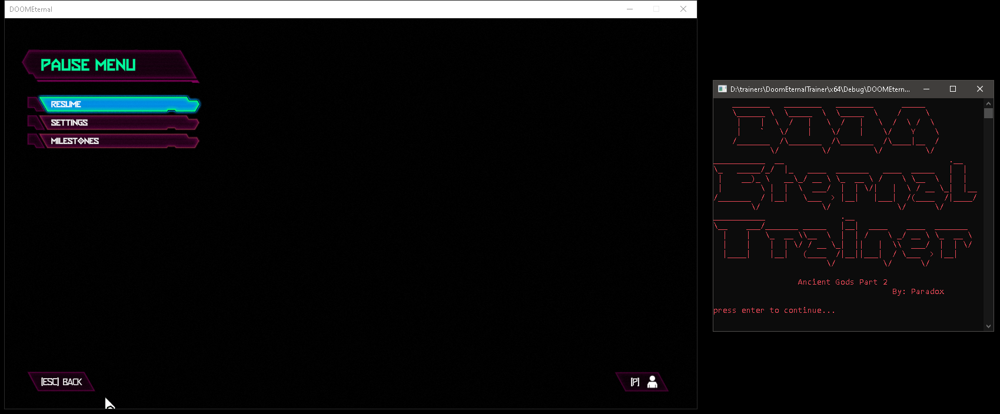
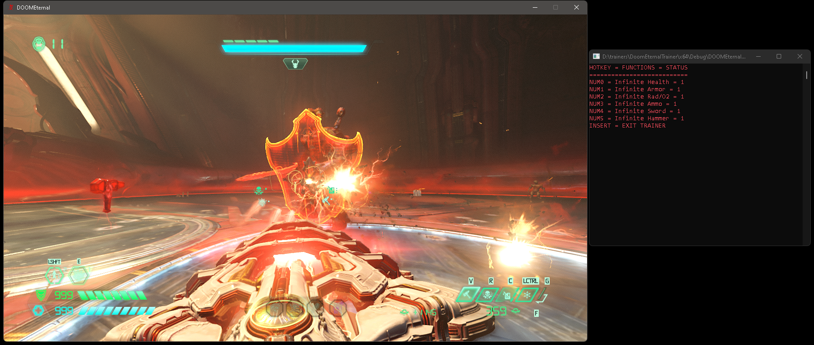
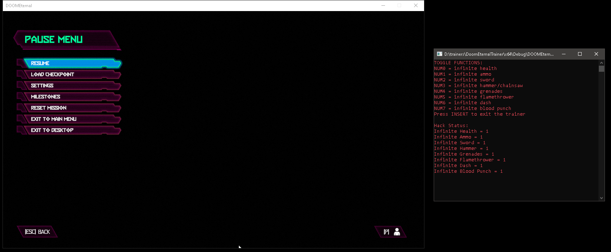

# DoomEternal-Trainer
Doom Eternal C++ trainer and accompanying cheat engine table for the latest DLC (Ancient Gods Part 2 Update 6.4).
 
 
The CT file is the cheat engine table that I made using a pointer address for the health and armor values and some AutoAssembly scripts for everything else.
 
 
The rest of the repository is an actual fully fleshed out trainer that runs in a C++ console window for Windows.
 
 
If you don't want to go through the trouble of compiling everything from source, just go into the x64/debug folders and use the DOOMEternalTrainer.exe file.
 
 
Alternatively, you can go to the the releases page <a href="https://github.com/iccugs/DoomEternalTrainer/releases">HERE</a> and download the latest version.
 
 
NOTES:
1. On the cheat engine table, you will see two auto-assembly scripts under "Health/Ammo." You can only pick one or the other because of the addresses they modify.
2. The grenade and flamethrower hacks work by changing the assembly opcodes from "dec" to "inc". This means that when you untoggle them, you may have to burn through extra grenades or flamethrower attacks to bring it back to normal.
 
 
Screenshots:

  

 

  

 

  

